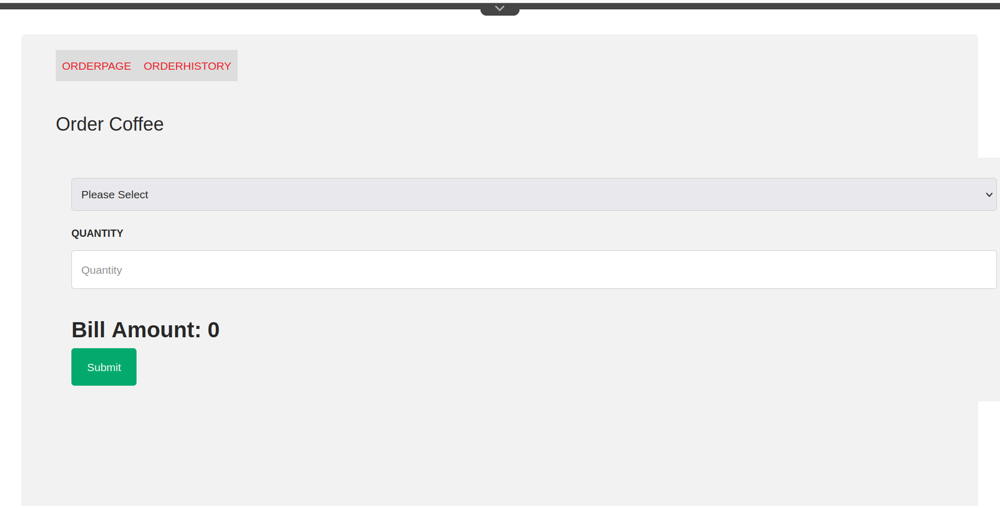
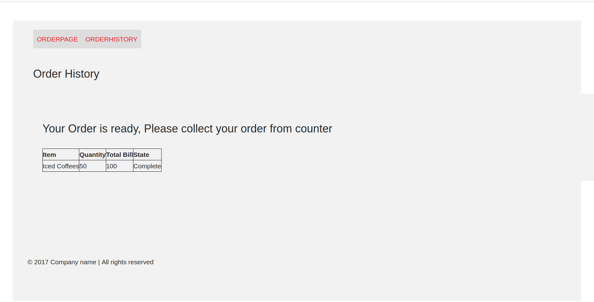
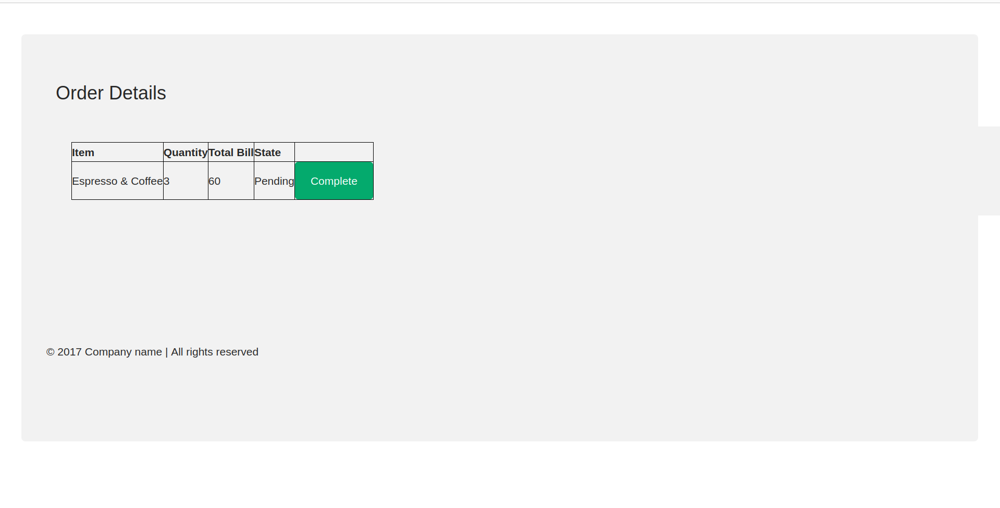

Question : Create component as below.
1. Create a form that can be used to order coffee. Should need certain inputs from user:

        Type of coffee (from a predefined list)

        Quantity

2. Display total bill as per some predefined prices
3. When user submits order, it should take user to a page showing order in pending state 
4. A page where list of all coffees ordered is displayed. User can go and complete order from there
5. Once confirmed, status of user order should be order fulfilled. And message should be shown to collect order from the counter.

Solution: Create component with below steps.

Step 1: Create a component for inputs from user.

HTML :

      <sly data-sly-use.clientlib="core/wcm/components/commons/v1/templates/clientlib.html">
          <sly data-sly-call="${clientlib.css @ categories='ttnBootcamp.cafe'}"/>
          <sly data-sly-call="${clientlib.js @ categories='ttnBootcamp.cafe'}"/>
      </sly>
      <h3>Order Coffee</h3>
      
      

              <select name="coffee" id="coffee" onchange="updateTotalPrice();">
                  <option>Please Select</option>
                  <option value='{"name":"Espresso","price":10}'>Espresso (Rs.10)</option>
                  <option value='{"name":"Espresso & Coffee","price":20}'>Espresso & Coffee (Rs.20)</option>
                  <option value='{"name":"Cold Brew","price":40}'>Cold Brew (Rs.40)</option>
                  <option value='{"name":"Cappuccino","price":10}'>Cappuccino (Rs.10)</option>
                  <option value='{"name":"Mocha","price":20}'>Mocha (Rs.20)</option>
                  <option value='{"name":"Iced Coffees","price":50}'>Iced Coffees (Rs.50)</option>
              </select>
              <label for="quantity">Quantity</label>
              <input type="text" id="quantity" name="quantity" onkeyup="updateTotalPrice();" placeholder="Quantity">
              <h2 class="modal-box">Bill Amount: 0</h2>
              <input onclick="onSubmit()" type="submit" value="Submit">
      

CSS: 

      body {font-family: Arial, Helvetica, sans-serif;}
      * {box-sizing: border-box;}
      
      input[type=text], select, textarea {
          width: 100%;
          padding: 12px;
          border: 1px solid #ccc;
          border-radius: 4px;
          box-sizing: border-box;
          margin-top: 6px;
          margin-bottom: 16px;
          resize: vertical;
      }
      
      input[type=submit] {
          background-color: #04AA6D;
          color: white;
          padding: 12px 20px;
          border: none;
          border-radius: 4px;
          cursor: pointer;
      }
      
      input[type=submit]:hover {
          background-color: #45a049;
      }
      
      .container {
          border-radius: 5px;
          background-color: #f2f2f2;
          padding: 20px;
      }

JS: 

      var updateTotalPrice = function () {
          console.log("updatecall");
          var coffee = $('#coffee').val();
          var quantity = $('#quantity').val();
          const obj = JSON.parse(coffee);
          if( coffee != "Please Select" && quantity !== "" ) {
              $('.modal-box').text("Bill Amount: "+(quantity*obj.price));
          } else {
              $('.modal-box').text("Bill Amount: "+0);
          }
      
      }
      
      var onSubmit = function () {
          var coffee = $('#coffee').val();
          var quantity = $('#quantity').val();
          const coffeeJson = JSON.parse(coffee);
      
          $.ajax
          ({
              url: '/content/ttnBootcamp/fr/en/api/submitOrder',
              data: JSON.stringify({"item": coffeeJson.name, "price": coffeeJson.price, "quantity": quantity, "state": "Pending"}),
              contentType: "application/json; charset=utf-8",
              crossDomain: true,
              dataType: "json",
              type: 'post',
              success: function (result) {
                  console.log(result)
                  window.location.replace("/content/ttnBootcamp/fr/orderhistory.html");
              }
          });
      }

Step 2: crate a page using above component for create order page.

Step 3: crate a component to show order history and order details.

HTML: 

      <sly data-sly-use.clientlib="core/wcm/components/commons/v1/templates/clientlib.html">
          <sly data-sly-call="${clientlib.css @ categories='ttnBootcamp.cafe'}"/>
          <sly data-sly-call="${clientlib.js @ categories='ttnBootcamp.cafe'}"/>
      </sly>
      <h3>${properties.title}</h3>
      
      

          

              <h3  data-sly-test="${orderhistoryModel.state == 'Complete' && !properties.showStateChangeButton}">Your Order is ready, Please collect your order from counter</h3>
              <table style="border:1px solid black;text-align: left;padding: 8px;">
                  <tr>
                      <th style="border:1px solid black;">Item</th>
                      <th style="border:1px solid black;">Quantity</th>
                      <th style="border:1px solid black;">Total Bill</th>
                      <th style="border:1px solid black;">State</th>
                  </tr>
                  <tr style="border:1px solid black;">
                      <td style="border:1px solid black;">${orderhistoryModel.item}</td>
                      <td style="border:1px solid black;">${orderhistoryModel.quantity}</td>
                      <td style="border:1px solid black;">${orderhistoryModel.bill}</td>
                      <td style="border:1px solid black;">${orderhistoryModel.state}</td>
                      <td style="border:1px solid black;" data-sly-test="${orderhistoryModel.state == 'Pending' && properties.showStateChangeButton}"><input type="submit" value="Complete" onclick="updateOrder('${orderhistoryModel.item  @context = 'text'}',${orderhistoryModel.quantity  @context = 'text'},${orderhistoryModel.price  @context = 'text'},'${orderhistoryModel.state  @context = 'text'}')"></td>
                  </tr>
              </table>
          

      

CSS:

      body {font-family: Arial, Helvetica, sans-serif;}
      * {box-sizing: border-box;}
      .container {
          border-radius: 5px;
          background-color: #f2f2f2;
          padding: 20px;
      }

JS:
      
      var updateOrder = function (item,price,quantity,state) {
          if(state=="Pending") {
              state = "Complete";
          }
          $.ajax
          ({
              url: '/content/ttnBootcamp/fr/en/api/submitOrder',
              data: JSON.stringify({"item": item, "price": price, "quantity": quantity, "state": state}),
              contentType: "application/json; charset=utf-8",
              crossDomain: true,
              dataType: "json",
              type: 'post',
              success: function (result) {
                  console.log(result)
                  window.location.replace("/content/ttnBootcamp/fr/orderdetails.html");
              }
          });
      }

Step 4:  Create a post servlet that will able to record the user input data and create a model for page history to show the ordered details.

Post Servlet:

      package com.ttn.bootcamp.core.servlets;
      
      import org.apache.commons.io.IOUtils;
      import org.apache.sling.api.SlingHttpServletRequest;
      import org.apache.sling.api.SlingHttpServletResponse;
      import org.apache.sling.api.resource.ModifiableValueMap;
      import org.apache.sling.api.resource.Resource;
      import org.apache.sling.api.resource.ResourceResolver;
      import org.apache.sling.api.servlets.HttpConstants;
      import org.apache.sling.api.servlets.SlingAllMethodsServlet;
      import org.apache.sling.servlets.annotations.SlingServletResourceTypes;
      import org.json.JSONException;
      import org.json.JSONObject;
      import org.osgi.service.component.annotations.Component;
      
      import javax.servlet.Servlet;
      import javax.servlet.ServletException;
      import java.io.IOException;
      
      @Component(service = {Servlet.class})
      @SlingServletResourceTypes(
              resourceTypes = "/order/submit",
              methods = HttpConstants.METHOD_POST
      )
      public class CoffeeCafeServlet extends SlingAllMethodsServlet {
      
          @Override
          protected void doPost(SlingHttpServletRequest request, SlingHttpServletResponse response) throws ServletException, IOException {
              String body = IOUtils.toString(request.getReader());
              ResourceResolver resourceResolver = request.getResourceResolver();
              Resource orderResource = resourceResolver.getResource("/content/ttnBootcamp/fr/orderhistory/jcr:content");
              JSONObject json = null;
              try {
                  json = new JSONObject(body);
      //            MyObject myObject = new Gson().fromJson(jsonString, MyObject.class);
              } catch (JSONException e) {
                  throw new RuntimeException(e);
              }
              if (orderResource != null) {
                  ModifiableValueMap properties = orderResource.adaptTo(ModifiableValueMap.class);
                  try {
                      properties.put("item", json.get("item"));
                  properties.put("price", json.get("price"));
                  properties.put("quantity", json.get("quantity"));
                  properties.put("state", json.get("state"));
                  resourceResolver.commit();
                  } catch (JSONException e) {
                      throw new RuntimeException(e);
                  }
              } else {
                      response.getWriter().println("Node /content/my-test/jcr:content not found.");
              }
              response.setContentType("application/json");
              JSONObject responceJson = new JSONObject();
              try {
                  responceJson.put("status","ok");
              } catch (JSONException e) {
                  throw new RuntimeException(e);
              }
              response.getWriter().write(responceJson.toString());
          }
      }

Order History Model:

      package com.ttn.bootcamp.core.models;
      
      import org.apache.sling.api.SlingHttpServletRequest;
      import org.apache.sling.api.resource.Resource;
      import org.apache.sling.models.annotations.Model;
      
      import javax.annotation.PostConstruct;
      import javax.inject.Inject;
      
      @Model(adaptables = SlingHttpServletRequest.class)
      public class OrderHistoryModel {
      @Inject
      private SlingHttpServletRequest request;
      
      private Resource resource;
      
          @PostConstruct
          public void init() {
              resource = this.request.getResourceResolver().getResource("/content/ttnBootcamp/fr/orderhistory/jcr:content");
          }
      
          public String getItem() {
              return resource.getValueMap().get("item", String.class);
          }
          public Integer getPrice() {
              return resource.getValueMap().get("price", Integer.class);
          }
          public Integer getQuantity() {
              return resource.getValueMap().get("quantity", Integer.class);
          }
          public String getState() {
              return resource.getValueMap().get("state", String.class);
          }
          public String getBill() {
              Integer totalBill = getPrice()*getQuantity();
              return totalBill.toString();
          }
      
      }

Step 5: Create two pages using above component one for order history(for customers) and one for Order Details(for mark order as ready) with authoring particular values.

Order History:

Order Details:

