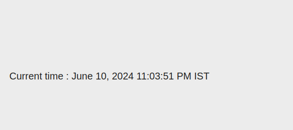

Question1: Print current time.

Answer: 
    Step 1:- Create a javaScript file to get current time.

    use(function () {
        const now = new Date();
        const formattedTime = now.toLocaleString();
        return {
            time: formattedTime
        };
    });

Step 2:- Use the javaScript file and get the time.

     <sly data-sly-use.jsTime="currentTime.js"></sly>
     
Current time : ${jsTime.time}

