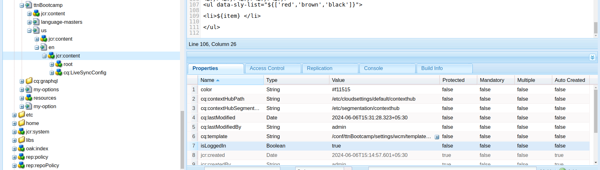

Question4: Write a Sightly script that checks if a variable named isLoggedIn is true. If isLoggedIn is true, display the message "Welcome back!" Otherwise, display the message "Please log in to continue.

Answer: 

Step 1: Create two div with data-sly-test on a page property isLoggedIn in the component.

    

        Welcome back!
    

    

        Please log in to continue.
    

Step 2: Create a property in that particular page jcr:content with value isLoggedIn false and look for result.

jcr:content property

result:-

Step 3: Change the isLoggedIn property value true and look for result.

jcr:content property

result:-

