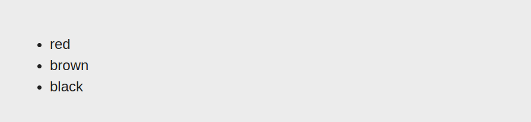

Question5: Given an array named colors containing three colors red,brown,black. write a Sightly script to loop through the array and display each color within an unordered list (<ul>).

Answer: Create a list in the data-sly-list with values red, brown, and black. We will get item object by default and we will use that in the li tag.

    <ul data-sly-list="${['red','brown','black']}">
    
    <li>${item}</li>
    
    </ul>

