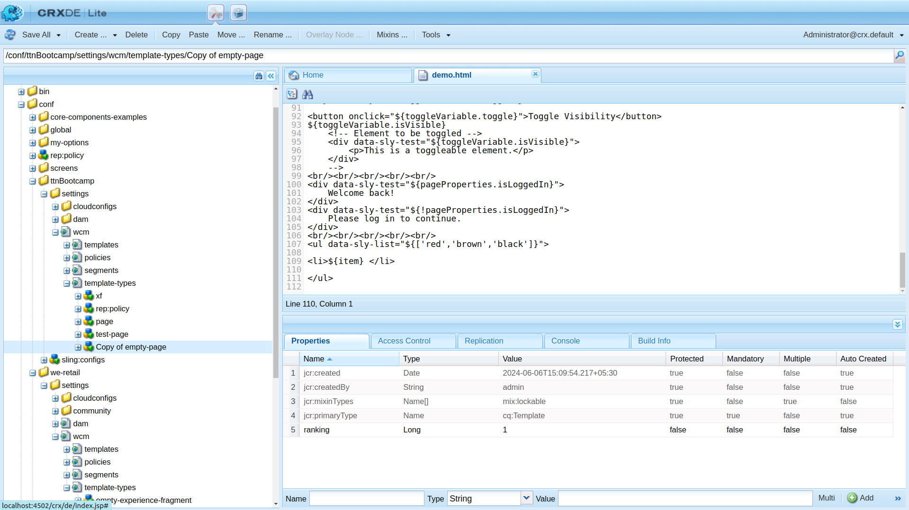
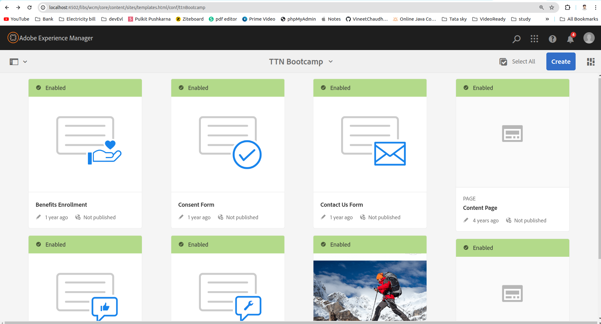
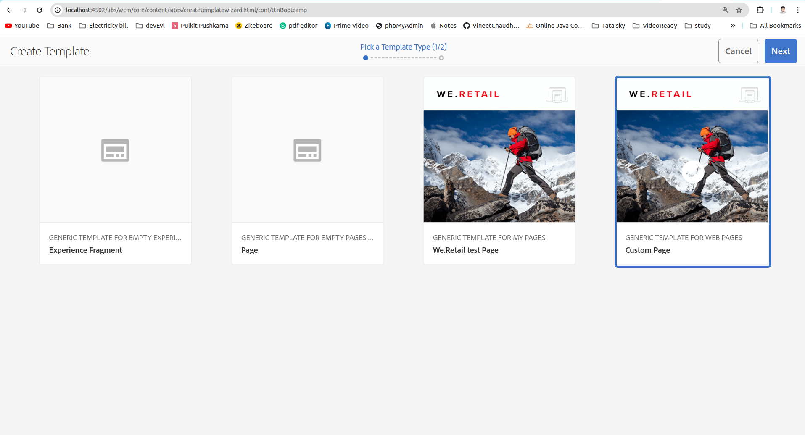
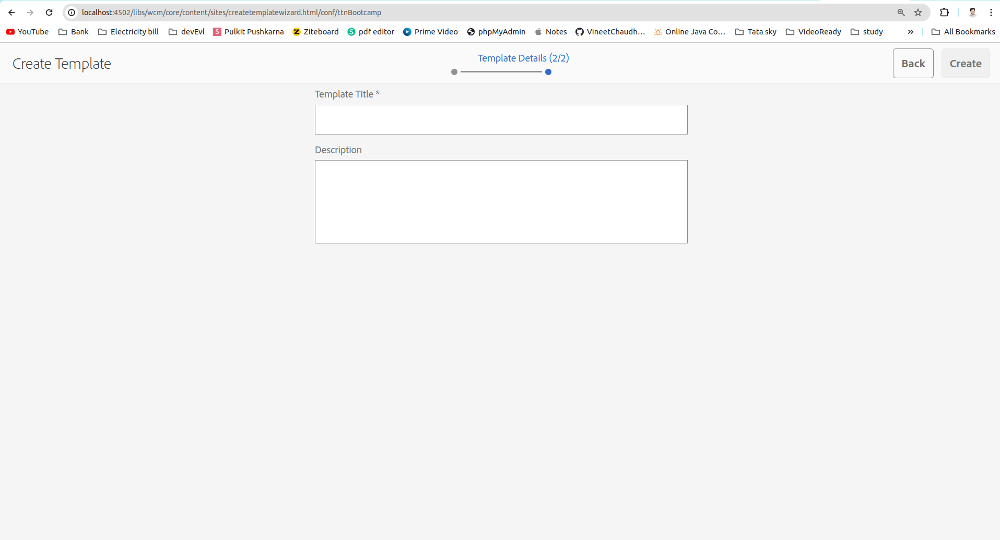
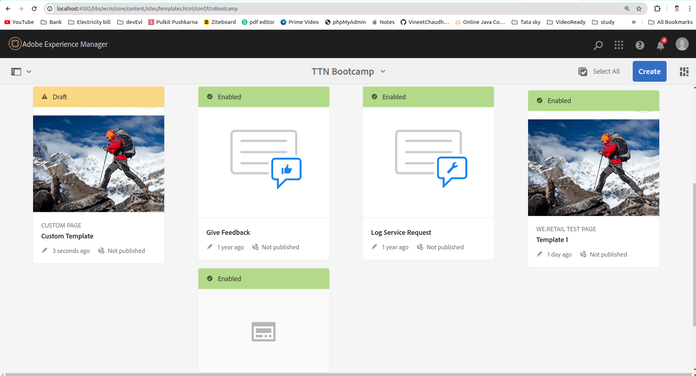

Question 1: Create a template from custom template type.

Answer: 

Step 1: Create a custom template type.
    We will be able to copy any template-type from other available template of any other project or from same project under the following path /conf/<Project Name>/settings/wcm/template-types/ and paste on the target project by following same path.

as we have copied the empty-page from /conf/we-retail/settings/wcm/template-types. And rename that with custom-page. And go to /conf/ttnBootcamp/settings/wcm/template-types/custom-page/jcr:content and change jcr:title to Custom Page.

Step 2: Go to http://localhost:4502/aem/start.html -> tools(from left bar) -> Templates, Select your project folder (in my case it's TTN Bootcamp).
        Then click on Create button 

Step 3: Select Custom Page (Custom page type) and click on next.

Step 4: Fill the Template Title and Description into the form.

And click on create.
You can see under Project Template. Custom Template is created.

