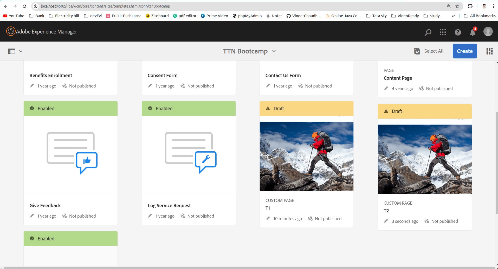
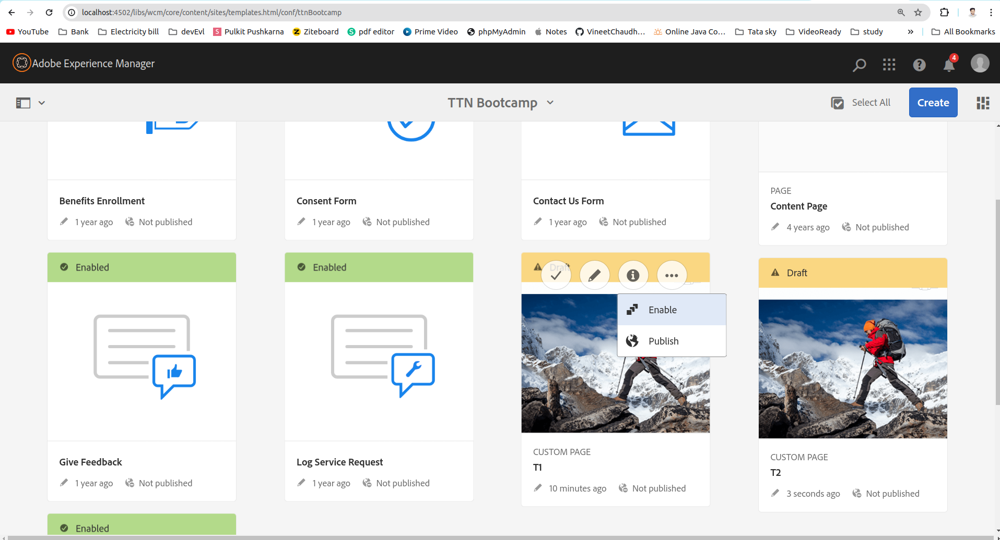
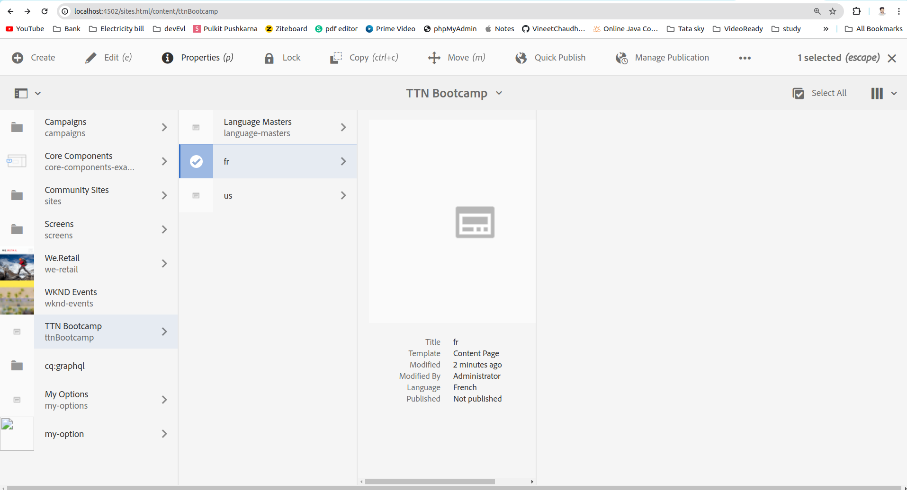
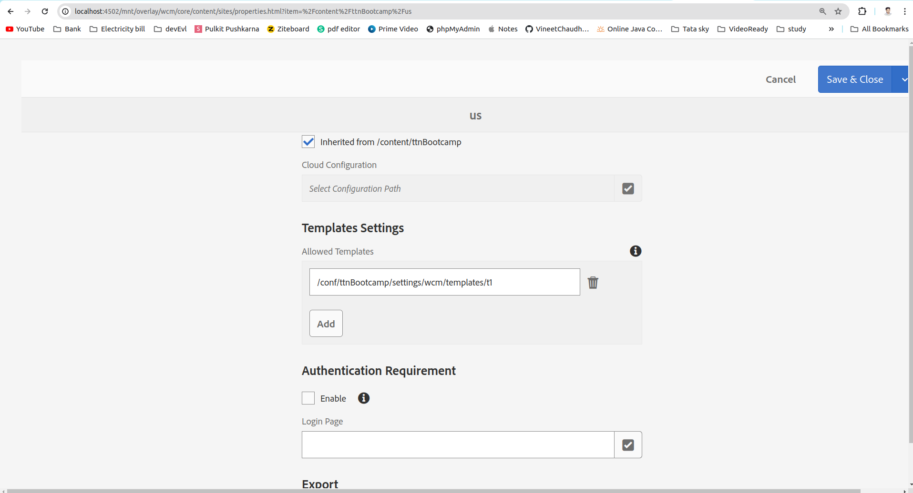
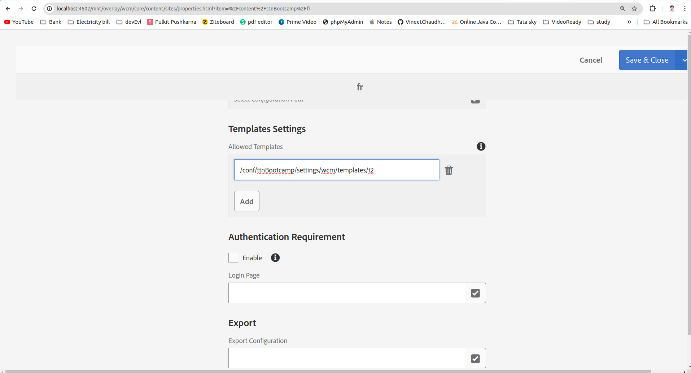

Question 2: Create two templates T1 and T2 such that T1 is only allowed under hierarchy “/content/my-site/us” and T2 is only allowed under “/content/my-site/fr”.

Answer: 

Step 1: Create template T1 and T2 as we have created in first question.

Step 2: Enable T1 and T2 template under project template page.

Step 3: Go to http://localhost:4502/aem/start.html -> sites -> Project (TTN Bootcamp in my case), Select us site and click on Properties on the above tab.

Step 4: Go TO Advanced tab and click on add button under Templates Settings (Allowed Templates).
        Set /conf/ttnBootcamp/settings/wcm/templates/t1 in the field and save.

Step 4: Now Select fr site and click on Properties on the above tab. Go TO Advanced tab and click on add button under Templates Settings (Allowed Templates).
        Set /conf/ttnBootcamp/settings/wcm/templates/t2 in the field and save.

As result you will able to see that if we are creating page on fr site we will be able to use only T2 template and if we create page on us site we will bo able to use only T1 template 

