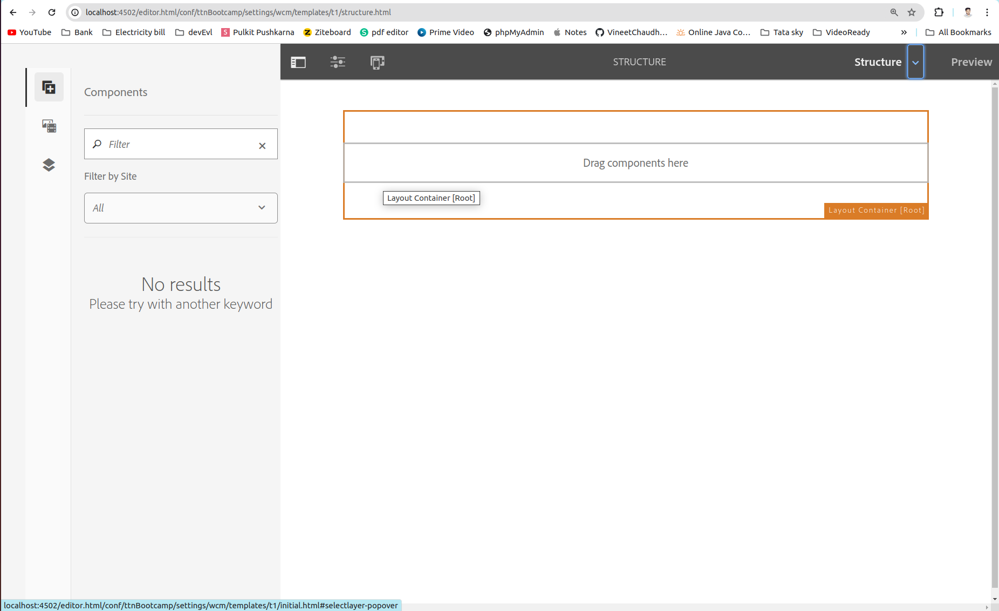
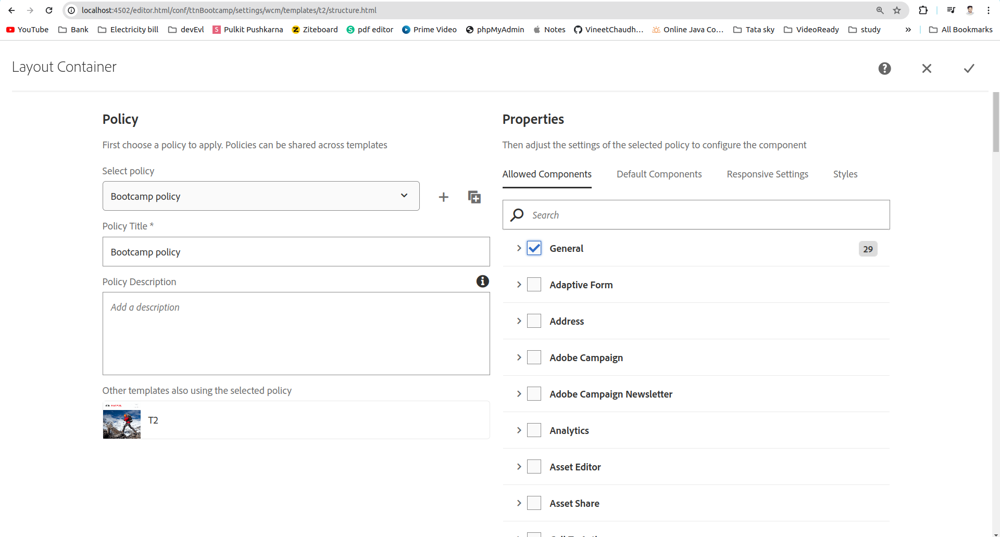
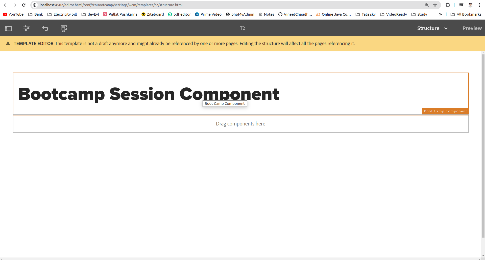

Question 3: Add a component on a template such that the content (authored properties) of the component remains exactly same on all the pages created using that template.

Answer: 

Step 1: Go to template under project(in my case it TTN Bootcamp) and click on edit button on template(using previous template T1).

Step 2: Change the component level policies, add allowed components if we are not getting any component on plus icon (+) on the Darg components dilog box.

Step 3: Click on insert icon (+) and select the component you want to add.

Now create any page using this template you will get this component on all the page.
Note: Even after creating the page if we are adding some component to the template on structure mode that will be reflect on all the pages.
