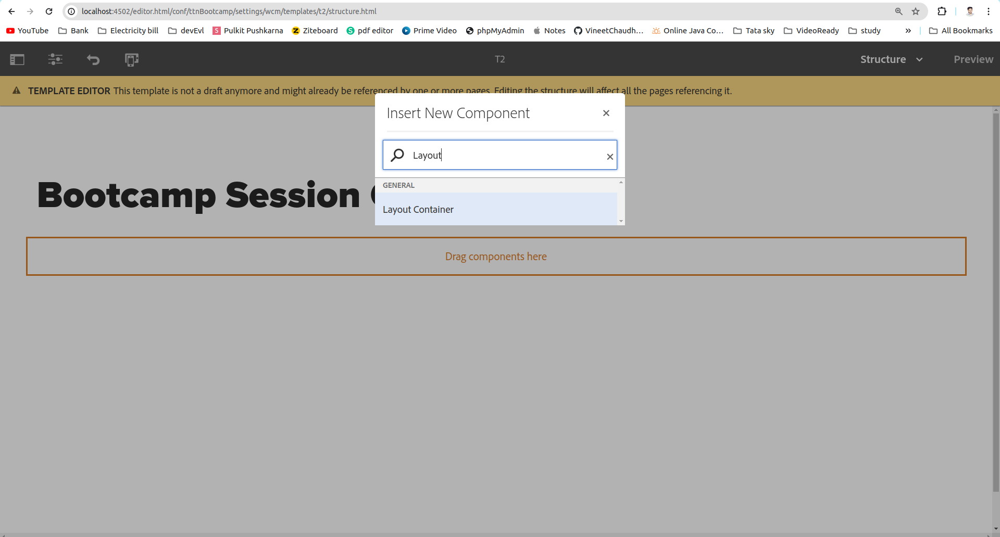
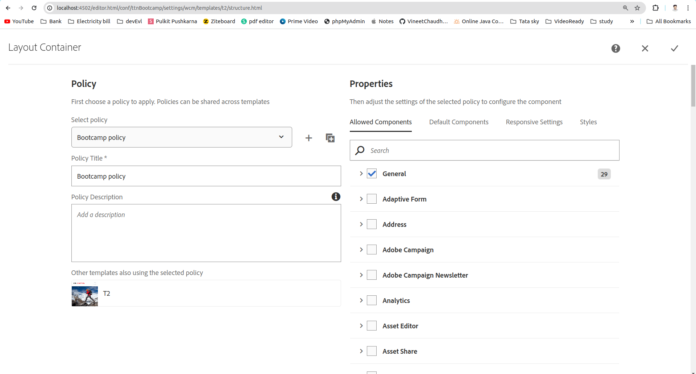
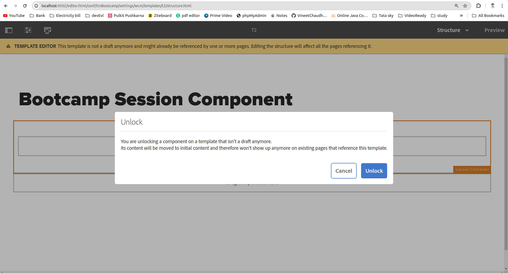
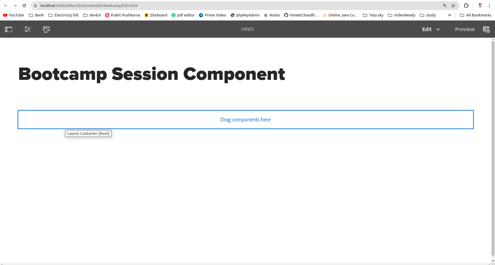

Question 4: Add a parsys (responsive grid/layout container) in the above template such that author can add any component from group “General” on the page.

Answer: 

Step 1: Click on Insert Component(+) icon to add component and  search for Layout Container and add.

Step 2: Edit newly added layout container policies and allow for the required components. 

Step 3: Unlock the newly added layout container.

Step 4: Now if you are editing any page which is using the above template(in my case it is t2 template), you can add component on that page.

