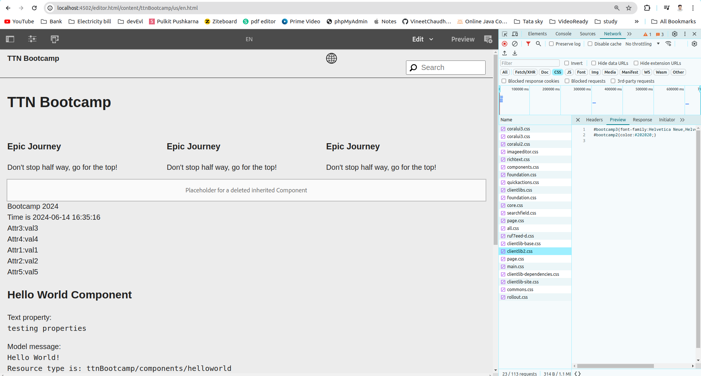

Question 3: Create 3 clientlibs. Embed clientlib3 in clientlib2 and clientlib2 in clientlib1. State the observation with respect to the number of calls and content of clientlib.

Answer: I have create 3 clientlibs as suggested in question with same embed properties.

In result when i request for the clientlib1, it has properties from clientlib1, and clientlib2 only.

So, as Observed embed cannot achieve on multi-level. Embed is allowed for one level. If we have such case that we required to embed above client libs, we have to embed all at one level e.g. clientlib3 in clientlib1, and clientlib2 in clientlib1.
