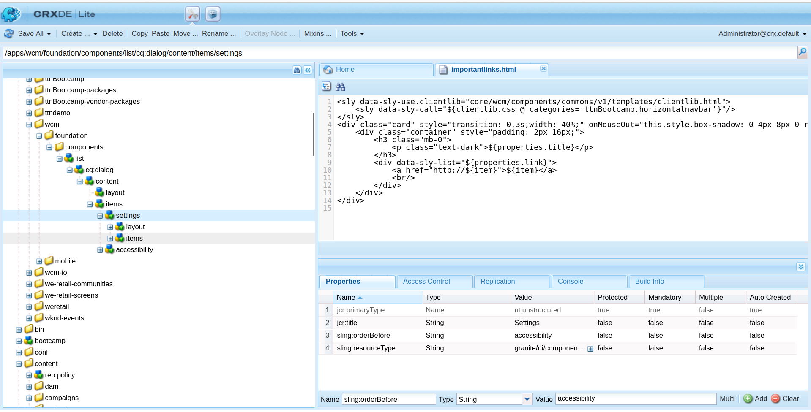
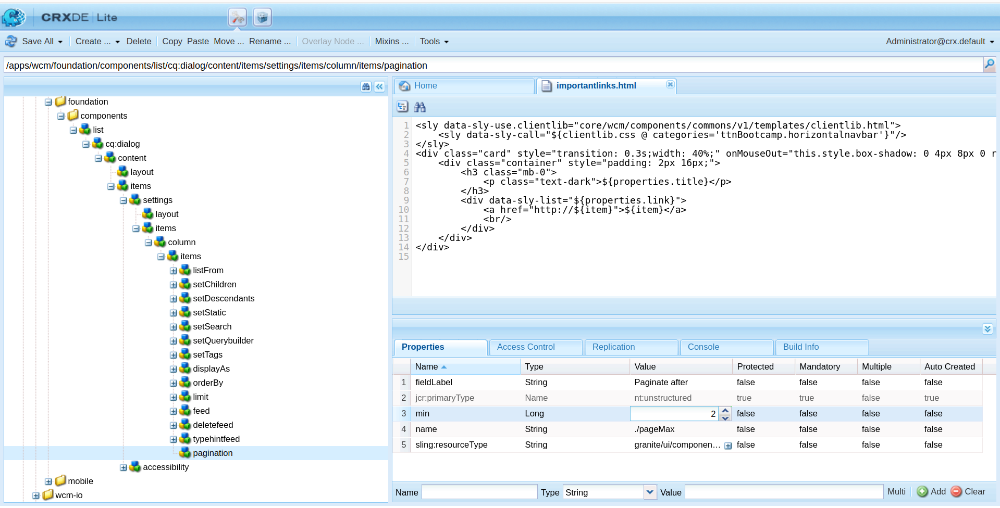
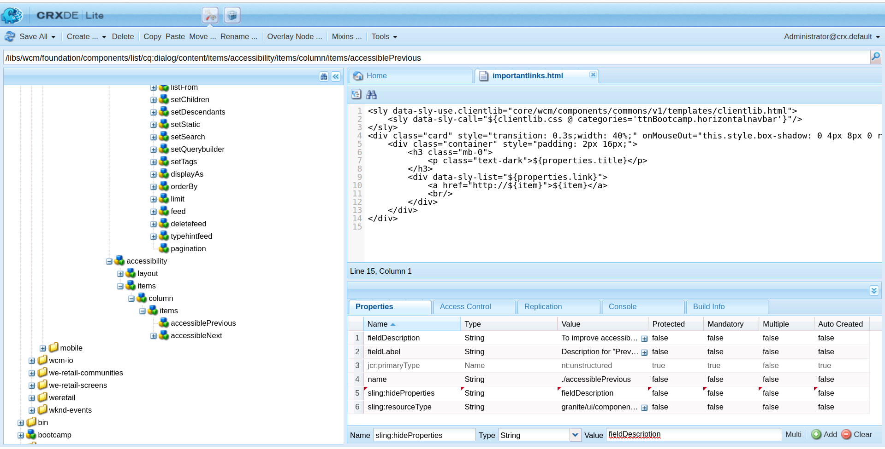

Question 3: Extend  list component of /libs/wcm/foundation/components/list and create  your own component with the following changes:
1. Move the Accessibility tab below the settings tab
2. In settings  tab , there is a property called “paginate after”, change the min property for this field from 0 to 2.
3. Make this “paginate after” property to appear as second last property in settings tab
4. Remove “Description” for  "Previous" property from Accessibility tab
5. Add one new property to settings tab and add title to list component

Answer:  Go to /libs/wcm/foundation/components/list and create Overlay node to the app directory.
1. Move the Accessibility tab below the settings tab

Step 1: Add sling:OrderBefore with value as accessibility property in settings.

2. In settings  tab , there is a property called “paginate after”, change the min property for this field from 0 to 2.

Step 2: Go to /apps/wcm/foundation/components/list/cq:dialog/content/items/settings/items/column/items/pagination set the value of min property as 2

3. Make this “paginate after” property to appear as second last property in settings tab

Step 3: 

4. Remove “Description” for  "Previous" property from Accessibility tab

Step 4: Go to /libs/wcm/foundation/components/list/cq:dialog/content/items/accessibility/items/column/items/accessiblePrevious and add property sling:hideProperties with value fieldDescription.

5. Add one new property to settings tab and add title to list component

Step 5: 
